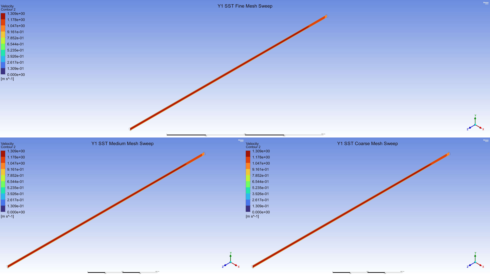
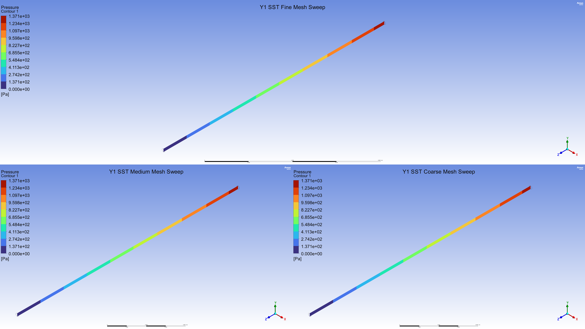

# CFD Study & Validation of Turbulent Pipe Flow

**Author:** Prashant Kamble  
**Field:** Computational Fluid Dynamics (CFD)  
**Software:** ANSYS Workbench, Fluent, ICEM CFD

---

## 1. Project Overview
This repository contains a comprehensive numerical simulation and validation study of turbulent flow in a circular pipe at a Reynolds number of $Re = 10,000$. The primary objective is to evaluate the predictive accuracy of various turbulence models (specifically SST $k$-$\omega$ and Realizable $k$-$\epsilon$) and examine the impact of near-wall grid resolution ($y^+$ study) against analytical formulations and the empirical Haaland correlation (1983).

---

## 2. Problem Description & Parameters
The physical setup consists of a three-dimensional pipe with a high length-to-diameter ratio to ensure fully developed turbulent flow in the downstream region.

### Geometric Configuration
* **Pipe Length ($L$):** $16\text{ m}$
* **Pipe Diameter ($D$):** $0.2\text{ m}$
* **Aspect Ratio ($L/D$):** $80$
* **Entrance Length (Theoretical):** Fully developed flow occurs after $L/D \approx 13.59$ ($L \approx 2.72\text{ m}$).

### Fluid Properties & Flow Conditions
* **Fluid Density ($\rho$):** $1,000\text{ kg/m}^3$
* **Dynamic Viscosity ($\mu$):** $0.02\text{ Pa}\cdot\text{s}$ (or $\text{kg}/(\text{m}\cdot\text{s})$)
* **Mean Inlet Velocity ($V_{avg}$):** $1.0\text{ m/s}$
* **Reynolds Number ($Re$):**
  $$Re = \frac{\rho V_{avg} D}{\mu} = \frac{1000 \times 1.0 \times 0.2}{0.02} = 10,000$$

---

## 3. Mathematical Models & Empirical Formulas
Numerical results for the Darcy friction factor ($f$), skin friction coefficient ($C_f$), and pressure drop ($\Delta P$) are validated using the following classical formulations:

1. **Darcy Friction Factor ($f$) - Haaland Equation (1983):**
   $$\frac{1}{\sqrt{f}} \approx -1.8 \log_{10} \left[ \left( \frac{\epsilon/D}{3.7} \right)^{1.11} + \frac{6.9}{Re} \right]$$
   For a smooth pipe ($\epsilon = 0$): $f = 0.030886$

2. **Skin Friction Coefficient ($C_f$):**
   $$C_f = \frac{f}{4} = 0.0077215$$

3. **Wall Shear Stress ($\tau_w$):**
   $$\tau_w = \frac{1}{2} \rho V_{avg}^2 C_f = 3.86\text{ Pa}$$

4. **Pressure Drop ($\Delta P$) - Darcy-Weisbach Equation:**
   $$\Delta P = f \frac{L}{D} \frac{\rho V_{avg}^2}{2}$$
   In the fully developed region (from $z = 6\text{ m}$ to $z = 16\text{ m}$, $L_{fd} = 10\text{ m}$):
   $$\Delta P_{Empirical} = 0.030886 \times \frac{10}{0.2} \times \frac{1000 \times 1.0^2}{2} = 772.15\text{ Pa}$$

---

## 4. Grid Independence & Near-Wall Study
To ensure numerical accuracy and grid convergence, three structured meshes were generated using sweep methods (ANSYS Meshing) and Hexa blocking (ICEM CFD):

* **Coarse Mesh:** 37,440 cells
* **Medium Mesh:** 72,000 cells
* **Fine Mesh:** 142,875 cells

### Viscous Sublayer Resolution ($y^+$ Study)
* **$y^+ \approx 1$ Mesh:** Requires a first-cell height of $y = 0.000318\text{ m}$ ($0.318\text{ mm}$) to fully resolve the viscous sublayer.
* **$y^+ \approx 10$ Mesh:** First-cell height set to $y = 0.00318\text{ m}$ ($3.18\text{ mm}$), utilizing wall functions.

### Near-Wall Grid Verification
Below is the distribution of the non-dimensional wall distance $y^+$ along the pipe boundary, illustrating wall layer resolution:

---

## 5. Key Results & Validation
Numerical evaluations taken at $z = 14\text{ m}$ (in the fully developed region) demonstrate high validation accuracy:

| Parameter | CFD (SST, $y^+ \approx 1$) | CFD (RKE, $y^+ \approx 1$) | Empirical (Haaland) | SST Error (%) | RKE Error (%) |
| :--- | :---: | :---: | :---: | :---: | :---: |
| **Darcy Friction Factor ($f$)** | $0.0325$ | $0.0341$ | $0.030886$ | **5.22%** | **10.40%** |
| **Skin Friction Coefficient ($C_f$)** | $0.00812$ | $0.00853$ | $0.00772$ | **5.18%** | **10.49%** |
| **Pressure Drop ($\Delta P_{6-16\text{m}}$)** | $811.70\text{ Pa}$ | $855.16\text{ Pa}$ | $772.15\text{ Pa}$ | **5.12%** | **10.75%** |

### Flow Visualization
* **Velocity Development:**
  
* **Pressure Drop Contours:**
  

### Velocity Profile Validation
* **Friction Velocity & Radial Profile:**
  
* **Analytical Comparison:**
  

### Key Observations
* **Turbulence Model Performance:** The Shear Stress Transport (SST) $k$-$\omega$ model displays superior accuracy (within ~5% error) compared to the Realizable $k$-$\epsilon$ (RKE) model (~11% error) in capturing near-wall gradients.
* **Grid Resolution:** Resolving the viscous sublayer ($y^+ \approx 1$) is critical for accurate near-wall velocity profiles. While $y^+ \approx 10$ with wall functions predicts bulk pressure drop effectively, it oversimplifies near-wall velocity distribution.
* **Mesh Portability:** Meshes exported from ANSYS Workbench and ICEM CFD Hexa show identical physical results, validating the spatial independence of the numerical setup.

---

## 6. Project Presentation
A detailed slide deck detailing the setup, plots, and visual post-processing (vectors, contours) is available in the root folder:  
📄 **[Turbulent-pipe-flow.pdf](Turbulent-pipe-flow.pdf)**

---

## 7. Conclusions
1. The **SST $k$-$\omega$ model** is the recommended choice for wall-bounded turbulent pipe flows at moderate Reynolds numbers, yielding predictions within 5% of Haaland's correlation.
2. Grid convergence is successfully achieved at a **medium grid resolution (72,000 cells)**, making it the most computationally efficient choice for design studies.
3. Proper viscous sublayer grid spacing ($y^+ \approx 1$) is mandatory for predicting wall-bounded friction parameters accurately.
